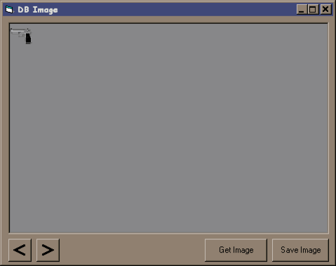



## Simple Database Image

### Description

This code demonstrates a simple way to save Images (or any binary

data for that matter) into a database...

I would like to receive all kinds of comments and suggestions

so, please give the same...
 
### More Info
 

I assume that you have made an Access DataBase named: pic.mdb

in the folder where you extract these files, This database must have

a table named - Table1 and this table must have a field - img

of datatype OLE Object

             |
---                |---
**Submitted On**   |2001-08-25 13:37:48
**By**             |[Rahul Vyas \(coder000\)](https://github.com/Planet-Source-Code/PSCIndex/blob/master/ByAuthor/rahul-vyas-coder000.md)
**Level**          |Intermediate
**User Rating**    |4.0 (16 globes from 4 users)
**Compatibility**  |VB 6\.0
**Category**       |[Databases/ Data Access/ DAO/ ADO](https://github.com/Planet-Source-Code/PSCIndex/blob/master/ByCategory/databases-data-access-dao-ado__1-6.md)
**World**          |[Visual Basic](https://github.com/Planet-Source-Code/PSCIndex/blob/master/ByWorld/visual-basic.md)
**Archive File**   |[Simple Dat253118252001\.zip](https://github.com/Planet-Source-Code/rahul-vyas-coder000-simple-database-image__1-26633/archive/master.zip)

